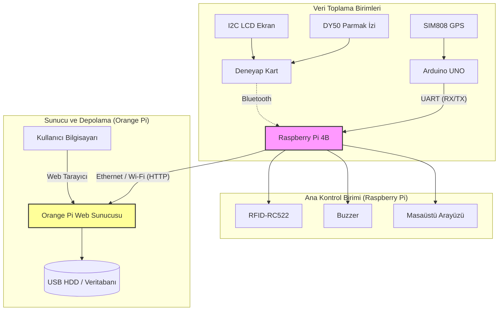
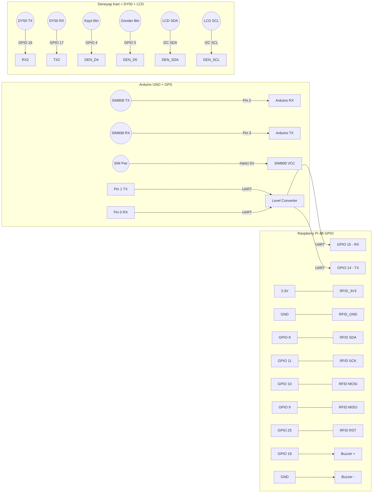
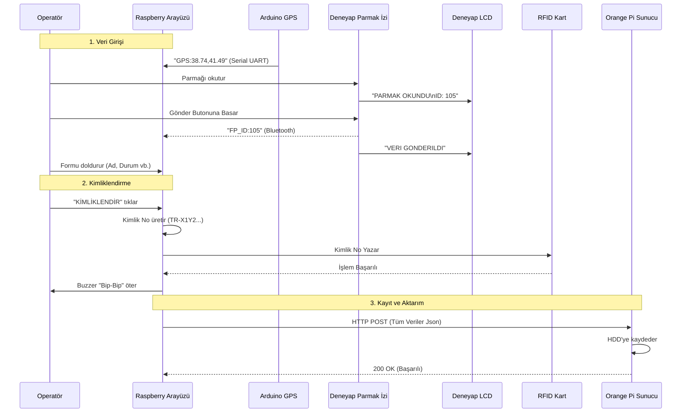

# TAMGA-ADKS Sistem Şemaları ve Çalışma Mantığı

Bu döküman, sistemin donanım bağlantılarını ve veri akışını görsel olarak açıklar.

## 1. Genel Sistem Mimarisi

Sistem 4 ana bileşenden oluşur:
1. **Veri Toplayıcılar:** Arduino (GPS) ve Deneyap (Parmak İzi)
2. **Ana Kontrolcü:** Raspberry Pi (Arayüz, RFID, Buzzer)
3. **Depolama ve Sunucu:** Orange Pi (Veritabanı, Web Arayüzü)

---

## 2. Donanım Bağlantı Şeması

Hangi pinin nereye bağlanacağını gösteren detaylı şema.

**ÖNEMLİ:** Arduino (5V) ve Raspberry Pi (3.3V) arasına Logic Level Converter takılmalıdır!

---

## 3. Veri Akış Senaryosu (Adım Adım)

Bir afetzede sisteme kaydedilirken veriler nasıl akar?

